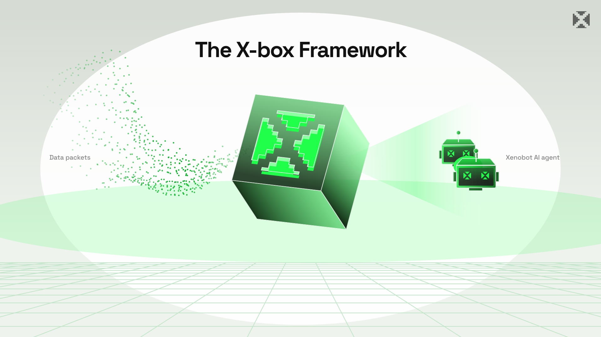

<picture>
    <source media="(prefers-color-scheme: dark)" srcset="img/Xbox.svg">
    <source media="(prefers-color-scheme: light)" srcset="img/Xbox.svg">
    
</picture>
 

&nbsp;

&nbsp;

 

&nbsp;